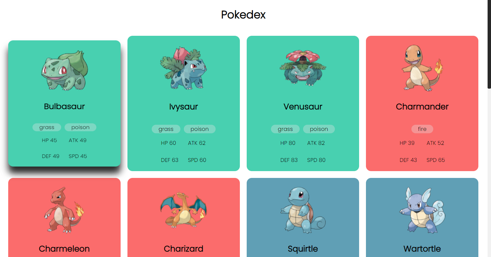
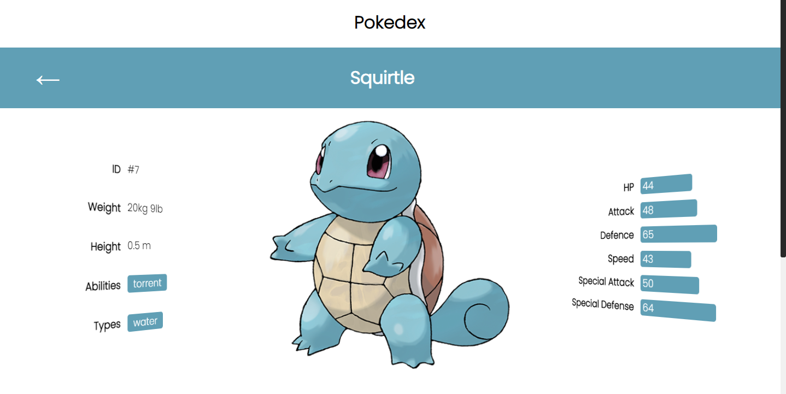

# React Pokedex 
A simple pokedex webpage showcasing pokemon, from [pokeapi.co](https://pokeapi.co/).

### Description
This website was made using ReactJS and utilizing react hooks to achieve the desired outcome. The goal of this app was to familiarize myself with react hooks and the fetch api, and learn about caching fetched data.

### Test on your own machine
- `git clone <this repository's link>`
- find the location to where you git cloned
- go to root of the cloned repository
- run `npm start`

### Current App Situation
Version 1.0
- Added a card type layout
- fetch metadata for each individual pokemon
- update UI to inspiration (below)
Version 1.1
- Added localstorage cache to pokemon evolution data
- Added mobile responsiveness

## Inspiration
The inspiration for the UI came from this github user: [link](https://github.com/topics/pokeapi-pokedex).